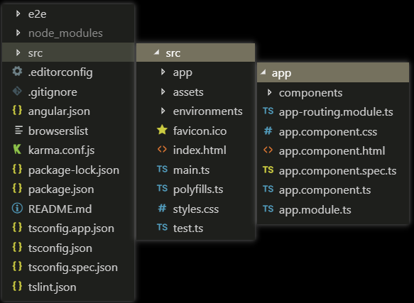

[TOC]
# 项目目录结构

## 项目目录结构图



## 说明
```javascript
|-- 文件名 // 说明
|-- 首层目录
    |-- e2e // 自动化集成测试目录
    |-- node_modules // npm/cnpm第三方依赖包存放目录
    |-- src // 应用源代码目录
    |-- .editorconfig // 不同编译器统一代码风格
    |-- .gitignore // git中的忽略文件列表
    |-- angular.json // Angular的配置文件
    |-- browserslist // 配置浏览器兼容性的文件
    |-- karma.conf.js // 自动化测试框架Karma的配置文件
    |-- package-lock.json // 依赖包版本锁定文件
    |-- package.json // 标准的npm工具的配置文件
    |-- README.md // 项目说明的MakeDown文件
    |-- tsconfig.app.json // app项目的TypeScript的配置文件
    |-- tsconfig.json // 整个工作区的TypeScript配置文件
    |-- tsconfig.spec.json // 用于测试的TypeScript配置文件
    |-- tslint.json // TypeScript的代码静态扫描配置

    |-- src目录
    |-- app // 工程源码目录
    |-- assets // 资源目录
    |-- environments // 环境配置目录
    |-- favicon.ico // header里的icon
    |-- index.html // 单页应用的宿主HTML
    |-- main.ts // 入口ts文件
    |-- polyfills.ts // 不同浏览器兼容脚本加载
    |-- karma.conf.js // 自动化测试框架Karma的配置文件
    |-- style.css // 整个项目的全局css
    |-- test.ts // 测试入口

        |-- app目录
            |-- app-routing.module.ts // app路由
            |-- app.component.css // app的css
            |-- app.component.html // app的html
            |-- app.component.spec.ts // app的测试
            |-- app.component.ts // app的组件
            |-- app.module.ts // app的模块
        |-- environments目录
            |-- environments.prod.ts // 生产环境
            |-- environments.ts // 开发环境
```

## 具体内容

### .editorconfig
****


### angular.json
****
```javascript
|-- angular.json // Angular的配置文件
|--首层目录 // 说明
    |--"$schema": "" // 架构关键字:指出如何形式描述XML文档的元素
    |--"version": 1, // 版本
    |--"newProjectRoot": "projects", // 新项目路径：多项目开发
    |--"projects": {}
    |--"defaultProject": "scrollable-tab" // 默认项目
    |--"projects": {}
        |--"scrollable-tab":{} // 项目scrollable-tab
            |--"projectType": "application",
            |--"schematics": {},
            |--"root": "",
            |--"sourceRoot": "src", // 项目根路径
            |--"prefix": "app", // 安装应用的指定目录
            |--"architect": {} // 架构目录
            |--"build": {} // 搭建命令文件目录
            |--"serve": {} // 服务命令文件目录
            |--"extract-i18n": {} // 语言翻译目录
            |--"test": {} // 测试目录
            |--"lint": {} // 代码规范目录
                |--"e2e": {} // 测试目录
                |--"builder": "@angular-devkit/build-angular:" // AG开发搭建路径
                |--"options": {} // 相关可选文件目录
                |--"configurations": {} // 配置文件目录
```

### browserslist
****
```JavaScript
// 只支持市场占有率＞0.5%的浏览器
> 0.5%
last 2 versions
Firefox ESR
not dead
// 不支持IE 9-11
not IE 9-11 # For IE 9-11 support, remove 'not'.
```
### package-lock.json&package.json
****
```JavaScript
|-- package-lock.json // 依赖包版本锁定文件
    |--"name": "scrollable-tab", // 包的名称 //包锁:必须与package.json内容匹配
    |--"version": "0.0.0", // 包的版本 //包锁:必须与package.json内容匹配
    |--"lockfileVersion": 1, // 整数版本，1从此文档的版本号开始，在生成此版本时使用其语义package-lock.json
    |--"requires": true, // 是否必需
    |--"dependencies"{} // 包的依赖目录
    
|-- package.json // 依赖包版本文件
    |--"name": "scrollable-tab", // 包的名称 //包锁:必须与package.json内容匹配
    |--"version": "0.0.0", // 包的版本 //包锁:必须与package.json内容匹配
    |--"scripts": {}, // 运行脚本命令目录
        |--"ng": "ng", // 全局命令
        |--"start": "ng serve", // 开发环境项目启动命令
        |--"start.prod": "ng serve --aot", // 生产环境项目启动命令
        |--"build": "ng build", // 项目打包命令
        |--"test": "ng test", // 项目测试命令
        |--"lint": "ng lint", // 项目静态编译检测语法命令
        |--"e2e": "ng e2e", // 测试命令语句
        |--"ivy": "ivy-ngcc" // 兼容性编译器命令语句
    |--"private": true, // 是否必需
    |--"dependencies"{} // 生产环境下包的依赖目录 8//大版本.0//小版本.0//补丁版本
        |--"@angular/animations": "~8.0.0", // ~:锁定大版本与小版本，补丁版本可变动
        |--"tslib": "^1.9.0", // ^:锁定大版本，小版本与补丁版本可变动
        |--"protractor": "5.4.0", // :严格锁定在该版本，全部版本都不可变动
    |--"devDependencies"{} // 开发环境下包的依赖目录
```

### app-routing.module.ts // app路由
****
```TypeScript
// 变量导入路径
import { NgModule } from '@angular/core';
import { Routes, RouterModule } from '@angular/router';
// 声明路由
const routes: Routes = [{
    // 默认路由路径
    path : '',
    // 默认路由组件
    component : HomeComponent
}];
// @angular/cli 打包的最小单位
/**
* @angular/cli 会检查所有 @NgModule 和路由配置，如果你配置了异步模块，cli 会自动把模块切分成独立的 chunk（块）
* 其它框架基本上都需要你自己去配置 webpack，自己定义切分 chunck 的规则而Angular 里面，打包和切分的动作是 @angular/cli 自动处理的，不需要你干预
* @NgModule 元数据类型图表
* */
@NgModule({
    // 导入模块
    imports: [RouterModule.forRoot(routes)],
    // 导出模块
    exports: [RouterModule]
})
// 导出控制器
export class AppRoutingModule { }
|--@NgModule元数据说明
    |--declarations: [] // 属于该模块的可声明对象（组件、指令和管道）的列表
    |--providers: [] // 依赖注入提供商的列表
    |--imports: [] // 被导入的模块列表
    |--exports: [] // 可导出的模块的可声明对象（组件、指令、管道类）列表
    |--bootstrap: [AppComponent] // 自动启动的组件列表,应用根组件才有
    |--entryComponents: [] // 可动态加载进视图的组件列表
```
### app.component.ts // app的组件
****
```TypeScript
import { Component } from '@angular/core';
// @Component组件是UI最小的渲染单位
/**
* Component修饰符可以让开发者通过Angular 的Component创建一个类似Java的class，并同时提供额外的元数据用于定义在运行环境中，这个component将如何运行/实例化以及被使用。
* Angular components实质是directives下的一个子集
* 不同于directive：Component始终存在一个视图模板，在这个视图模板中，每一个元素只能有一个component被实例化
* Component元数据说明图表
*/
@Component({
// 其他组件导入选择器
selector: 'app-root',
// 该组件模板路径template / templateUrl
templateUrl: './app.component.html',
// 该样式路径 styles / styleUrls
styleUrls: ['./app.component.css']
})
// 导出控制器
export class AppComponent {}
|--@Component元数据说明
    |--继承于Directive装饰器
    |--selector: string // CSS选择器用于在模板中标记出该指令，并触发该指令的实例化
    |--inputs: string[] // 列举某个指令的一组可供数据绑定的输入属性
    |--outputsstring[] // 列举一组可供事件绑定的输出属性
    |--providers: Provider[] // 一组依赖注入令牌，它允许DI系统为这个指令或组件提供依赖
    |--exportAs: string // 定义一个名字，用于在模板中把该指令赋值给一个变量
    |--queries: {[key: string]: any;} // 配置一些查询，它们将被注入到该指令中
    |--host: {[key: string]: string;} // 使用一组键值对，把类的属性映射到宿主元素的绑定（属性，属和事件）
    |--jit: true // 如果为真，则该指令/组件将会被AOT编译器忽略，始终使用JIT编译
|--自身的元数据
    |--changeDetection: ChangeDetectionStrategy // 用于当前组件的变更检测策略
    |--viewProviders: Provider[] // 定义一组可注入对象，它们在视图的各个子节点中可用
    |--moduleId: string // 包含该组件的那个模块的 ID。该组件必须能解析模板和样式表中使用的相对 URL。 SystemJS 在每个模块中都导出了 __moduleName 变量。在 CommonJS 中，它可以设置为 module.id。
    |--templateUrl/template: string // Angular 组件模板文件的 URL/Angular 组件的内联模板
    |--styleUrls/styles: string[] // Angular 组件样式文件的 URL/Angular 组件的内联样式
    |--animations: any[] // 一个或多个动画 trigger() 调用，包含一些 state() 和 transition() 定义
    |--encapsulation: ViewEncapsulation // 改写默认的插值表达式起止分界符（{{ 和 }}）
    |--interpolation: [string, string] // 供模板和 CSS 样式使用的样式封装策略
    |--entryComponents: Array<Type<any> | any[]> // 一个组件的集合，它应该和当前组件一起编译。对于这里列出的每个组件，Angular 都会创建一个 ComponentFactory 并保存进 ComponentFactoryResolver 中。
    |--preserveWhitespaces: boolean // 如果为true 则保留，为 false 则从编译后的模板中移除可能多余的空白字符。 空白字符就是指那些能在 JavaScript 正则表达式中匹配 \s 的字符。默认为 false，除非通过编译器选项改写了它
```
### app.module.ts // app的模块
****
```TypeScript
import { BrowserModule } from '@angular/platform-browser';
import { NgModule } from '@angular/core';
import { AppRoutingModule } from './app-routing.module';
import { AppComponent } from './app.component';
@NgModule({
declarations: [
    AppComponent,
],
imports: [
    BrowserModule,
    AppRoutingModule,
    HomeModule,
    ScrollableTabModule
],
providers: [],
bootstrap: [AppComponent]
})
export class AppModule { }
```
