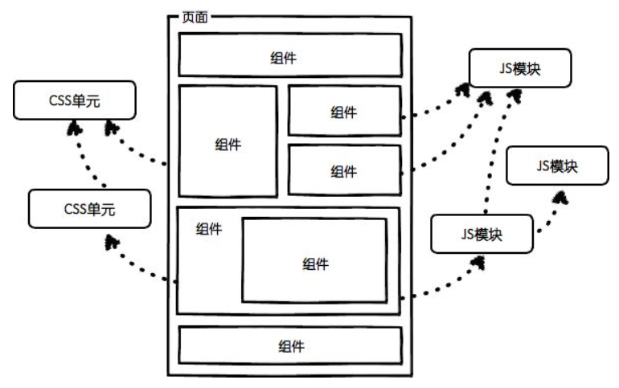

[TOC]
# 模块化&组件化

## 原因

高耦合、低内聚、无重用

## 图解

## 模块化Module

### 概念
以功能为划分，将同一类型代码整合为一个同属于一个业务的模块
### 使用
按照项目功能需求划分成不同类型的业务框架（例如：注册、登录、外卖、直播.....）
### 目的
隔离/封装 （高内聚）
### 依赖
模块之间有依赖的关系，可通过路由器进行模块之间的耦合问题
### 架构定位
横向分块（位于架构业务框架层）
### 内容：组件内的Script

****

## 组件化

### 概念
重复的代码提炼出一个个组件给功能使用
### 使用
Dialog，各种自定义的UI控件、能在项目或者不同项目重复应用的代码等等
### 目的：复用，解耦        
### 依赖
组件之间低依赖，比较独立
### 架构定位
纵向分层（位于架构底层，被其他层所依赖）
### 内容：template、style 和 script

**参考文献**
https://blog.csdn.net/qq_36709020/article/details/80056736
https://www.jianshu.com/p/cac0beae8876
https://www.jianshu.com/p/f5212cf7df55

