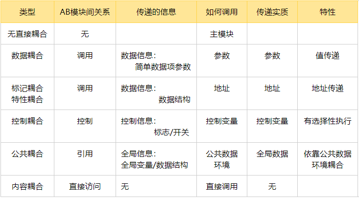

[TOC]
# 模块化

## 框架图

****
## 耦合性

### 定义

#### 1/块间联系
模块之间联系越紧密==>其耦合性就越强==>模块的独立性则越差
#### 2/模块间依赖程度
指软件系统结构中各模块间相互联系紧密程度

### 要素

#### 1/模块间接口的复杂性
#### 2/调用的方式
#### 3/传递的信息

### 分类：低->高

#### 无直接耦合
- AB模块间无直接关系
- AB间的联系完全是通过主模块的控制和调用来实现的
- 耦合度最弱，模块独立性最强
- **E.G：模块A实现输出字符串，模块B实现接收int数据，两者之间没有信息传递。这种情况下模块A和模块B就是非直接耦合**
#### 数据耦合
- 指AB模块间有调用关系
- 传递的是简单的数据值，相当于高级语言的值传递
- **E.G：模块A实现两个数的加法操作，模块B实现两个加数的初始化，模块B将两个加数传给模块A，模块A进行相加。这种情况下模块A和模块B就是数据耦合**
#### 标记耦合
- 传递的是数据结构，如高级语言中的数组名、记录名、文件名等这些名字即标记
- 实质为传递该数据结构的地址
- **E.G：模块A向模块B传递Object类型的数据。这种情况下模块A和模块B就是标记耦合**
#### 控制耦合
- 指AB模块间有调用关系
- 传递的是控制变量，如开关、标志等
- 被调模块通过该控制变量的值有选择地执行块内某一功能
- **E.G：模块A获取用户类型（普通用户、高级用户）传递给模块B，模块B根据不同类型的用户提供不同的服务。这种情况下模块A和模块B就是控制耦合**
#### 公共耦合
- 指通过一个公共数据环境相互作用的那些模块间的耦合
- 公共数据环境可以是全局数据结构、共享的通信区、内存的公共覆盖区等
- 若模块只是向公共数据环境输入数据，或是只从公共数据环境取出数据，这属于比较松散的公共耦合
- 若模块既向公共数据环境输入数据又从公共数据环境取出数据，这属于较紧密的公共耦合
- 公共耦合的复杂程序随耦合模块的个数增加而增加
- **E.G：定义了一个全局变量a，在A、B、C模块中均调用了a，这种情况下模块A、模块B、模块C就是公共耦合**
****
**公共耦合会引起以下问题：** 
1. 无法控制各个模块对公共数据的存取，严重影响了软件模块的可靠性和适应性。 
2. 使软件的可维护性变差。若一个模块修改了公共数据，则会影响相关模块。 
3. 降低了软件的可理解性。不容易清楚知道哪些数据被哪些模块所共享，排错困难。 
一般地，仅当模块间共享的数据很多且通过参数传递很不方便时，才使用公共耦合。
****
#### 内容耦合
- 最高程度的耦合，也是最差的耦
- A模块直接访问B模块的内容
- A模块直接使用B模块的内部数据
- B模块通过非正常入口而直接转入A模块内部
- 一个模块有多个入口
- AB模块有一部分代码重叠（该部分代码具有一定的独立功能）
- 可能在汇编语言中出现
- **E.G：模块A中定义了变量a，在模块B中直接使用了。这种情况下模块A和模块B就是内容耦合**

**** 
## 内聚性

### 定义

#### 1/块内联系
模块的功能强度/紧密程度的度量
#### 2/模块内紧密程度
一个模块内各元素（语名之间、程序段之间）联系的越紧密==>内聚性就越高

### 分类：低->高

#### 偶然内聚/巧合内聚
- 指同一个模块内的各处理元素之间没有任何联系
- 内聚程度最低
- **E.G：A模块中有三条语句（一条赋值，一条求和，一条传参），表面上看不出任何联系，但是B、C模块中都用到了这三条语句，于是将这三条语句合并成了模块A。模块A中就是偶然内聚**
#### 逻辑内聚
- 指同一个模块内执行几个逻辑上**相似**的**功能**，通过参数确定该模块应完成哪一个功能
- **E.G：A模块实现的是将对应的人员信息发送给技术部，人事部和财政部，决定发送给哪个部门是输入的控制标志决定的。模块A中就是逻辑内聚**
#### 时间内聚
- 指同一个模块内将需要**同时执行**的动作组合在一起
- **E.G：编程开始时，程序员把对所有全局变量的初始化操作放在模块A中。模块A中就是时间内聚**
#### 过程内聚
- 指模块内部的处理成分是相关的，而且这些处理必须以特定的次序进行执行
- **E.G：用户登陆了某某网站，A模块负责依次读取用户的用户名、邮箱和联系方式，这个次序是事先规定的，不能改变。模块A中就是过程内聚**
#### 通信内聚/信息内聚 
- 指各处理模块都使用**相同**的输入**数据**或者产生相同的输出数据
- 指模块内所有处理元素都在同一个数据结构上操作
- 或所有处理功能都通过公用数据而发生关联（有时称之为信息内聚）
- **E.G：模块A实现将传入的Date类型数据转换成String类型，以及将Date类型数据插入数据库，这两个操作都是对“Date类型数据”而言的。模块A中就是通信内聚**
#### 顺序内聚/过程内聚
- 指一个模块中各个处理元素都密切相关于同一功能且必须**顺序执行**，前一功能元素输出就是下一功能元素的输入
- 顺序内聚的内聚度比较高，但缺点是不如功能内聚易于维护
- **E.G.模块A实现将传入的Date类型数据转换成String类型，然后再将转换好的String类型数据插入数据库。模块A中就是顺序内聚**
#### 功能内聚
- 指模块内所有元素共同完成一个功能，**缺一不可**
- 最强的内聚，与其他模块的耦合是最弱的
- 优点是它的功能明确
- 判断一个模块是否功能内聚，一般从模块名称就能看出。如果模块名称只有一个动词和一个特定的目标（单数名词），一般来说就是功能内聚 
- 功能内聚模块的一个重要特点是：他是一个“暗盒”，对于该模块的调用者来说，只需要知道这个模块能做什么，而不需要知道这个模块是如何做的
- **E.G.模块A实现将新注册的用户信息（用户名，密码，个性签名）全部转换成String类型并插入数据库**

****
## 高内聚，低耦合的系统的优势？

更好的重用性，维护性，扩展性

## 高内聚低耦合是否意味着内聚越高越好，耦合越低越好？
### 真正好的设计是在高内聚和低耦合间进行平衡，也就是说高内聚和低耦合是冲突的。
### 从内聚上
最强的内聚：一个类只写一个函数==>类的数量急剧增多==>其它类的耦合特别多==>整个设计就变成了“高内聚高耦合”==>由于高耦合，整个系统变动同样非常频繁
### 从耦合上
最弱的耦合:一个类包含所有的函数，这样类完全不依赖其它类，耦合性是最低的==>内聚性很低==>整个设计就变成了“低耦合低内聚“==>由于低内聚，整个类的变动同样非常频繁

## 软件设计时，如何做好高内聚低耦合？
### 从内聚上
在模块划分时，要遵循“一个模块，一个功能”的原则，尽可能使模块达到功能内聚
### 从耦合上
建立模块间尽可能松散的系统，在设计上我们应采用以下原则：若模块间必须存在耦合，应尽量使用数据耦合，少用控制耦合，慎用或有控制地使用公共耦合，并限制公共耦合的范围，尽量避免内容耦合。

